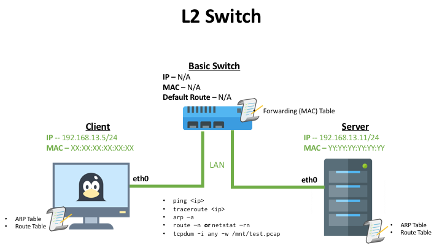
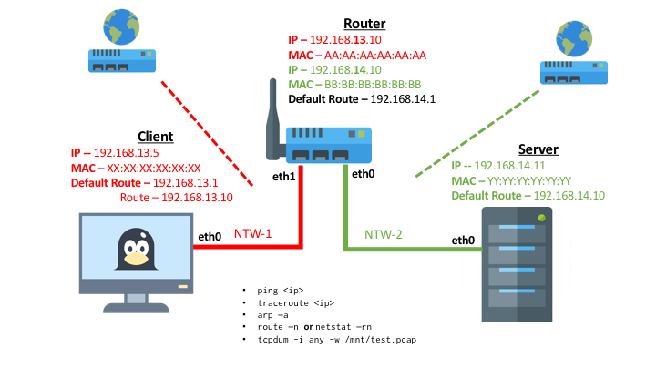
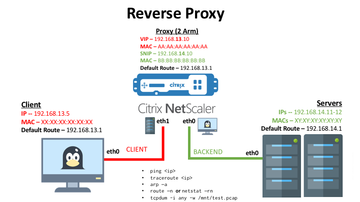
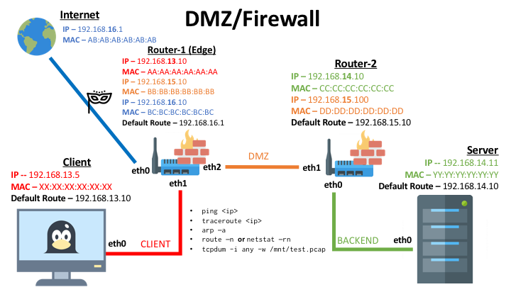
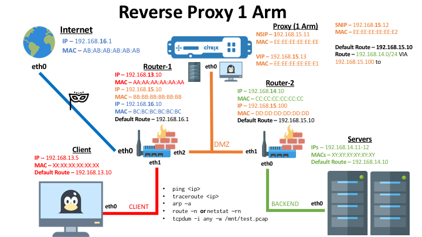

# Intermediate Networking

Here is a breakdown of the various exercises that can be performed with the following provided environment topologies within each subsequent folder's `docker-compose.yaml` file. There are 5 simple topologies provided where you can investigate network traffic within the docker network. You can explore networking across a basic L2 Switch, L3 Router, a Reverse Proxy, and a Network Firewall. 

> The only pre-requisite for this tutorial is to have [Docker installed](https://docs.docker.com/engine/installation/) on your local machine. 

# Quick Start

Before starting this tutorial, please read the following information: 

  * [Quick Start: Isolated Sandbox Environment](./Sandbox.md)
  * [Basic Networking tools and command line utilities](./docs/Networking-tools.md)
  * [Accessing Infrastructure Components](./docs/Access.md)

# Topologies 

Here we will explore different types of network topologies that will allow us to examine and showcase various basic network troubleshooting tools. Within each module, we will configure routes, firewall rules, LB rules, and  other configuration to allow proper network access from Client to Server via Routers and reverse proxies. 

---

## [Topology 1](./Switch)



This topology is a simple environment with a **Client** and **Server** are on a single **LAN** network.
  
  * Explore `arp` commands
  * Explore `ping` commands
  * Expolre `tcpdump` commands
  * Explore `curl` commands

>Follow [these instructions](./Switch) to get started.

---

## [Topology 2](./Router)



This topology is a simple environment with a **Client**, **Server**, and a **Router** across two LAN networks: **CLIENT** and **BACKEND**.
  
  * Explore `arp` commands
  * Explore `ping` commands
  * Expolre `tcpdump` commands
  * Explore `curl` commands
  * Explore `traceroute` commands 
  * Explore [`route`](https://www.cyberciti.biz/faq/linux-route-add/) commands

>Follow [these instructions](./Router) to get started.

---

## [Topology 3](./Proxy) 

> NOTE: THIS MODULE/TOPOLOGY IS NOT FUNCTIONING PROPERLY WITHIN DOCKER. I HAVE TO FIX THIS, PELASE REFER TO 1 ARM TOPOLOGY TO INVESTIGATE REVERSE PROXY TRAFFIC



This topology is a simple environment with a **Client**, **Server-a**, **Server-b** and a **Reverse Proxy** across two docker networks: **CLIENT** and **BACKEND**.
  
  * Explore `arp` commands
  * Explore `ping` commands
  * Expolre `tcpdump` commands
  * Explore `curl` commands
  * Explore `traceroute` commands

>Follow [these instructions](./Proxy) to get started.

---

## [Topology 4](./DMZ) 



This topology is an environment with a **Client**, **Server-a**, **Server-b**, **Edge Router / Firewall**, and an internal facing **Router-2 / Firewall**. In this environment we have 3 networks: **CLient**, **DMZ**, and **BACKEND**. 
  
  * Explore `arp` commands
  * Explore `ping` commands
  * Expolre `tcpdump` commands
  * Explore `curl` commands
  * Explore `traceroute` commands
  * Explore `iptable` commands
  * Explore multi hop routing.

>Follow [these instructions](./DMZ) to get started.

---

## [Topology 5](./1-Arm) 



This topology is an extension of Topology 4 where in this environment we have a **Client**, **Server-a**, **Server-b**, **Edge Router / Firewall**, an internal facing **Router-2 / Firewall**, and a 1 arm deployment of a **Reverse Proxy** in the DMZ. In this environment we have 3 networks: **CLient**, **DMZ**, and **BACKEND**. 
  
  * Explore `arp` commands
  * Explore `ping` commands
  * Expolre `tcpdump` commands
  * Explore `curl` commands
  * Explore `traceroute` commands
  * Explore `iptable` commands
  * Explore multi hop routing.
  * Explore 1 arm deployment design considerations

>Follow [these instructions](./1-arm) to get started.

# General Instructions

## Sandbox Environment 

If you perfer to provision a sandboxed self-contained environment for testing, then proceed to [follow these instructions](./sandbox.md) prior to executing subsequent steps. 

## Provision your Environment

Within each environment's respective directory (`Switch`, `Router`, `Proxy`) enter the following commands to provision your environment for the respective module: 

```bash
docker-compose up -d
```

This will spin up configured infrastructure components as described above. 

### De-provision your Environment

Within the same directory you provisioned the environment, enter the following command: 

```bash
# Assuming you are in ./NTW-201/Switch or ./NTW-201/Router or ./NTW-201/Proxy directory, enter: 
docker-compose down
```

### Accessing your service's CLI

Once your containers are running and your environment has provisioned successfully, you can execute into the shell of any infrastructure component. See command and descriptions below.

**To view running containers, enter the following.**

```bash
docker-compose ps -a
```

**Execute into the CLI of the container, enter the following.**

```bash
docker-compose exec <service-name> bash
```

If you are in performing this tutorial within the sandbox environment, you can leverage the `sh` alias to enter into the container's CLI with the following coomand: 

```bash
sh <service-name>
```

> Service name can be found in the [docker-compose.yaml](./docker-compose.yaml) file. For example you can enter the following values with respect to your provisioned environment: 
  - client
  - server
  - server-a
  - server-b
  - edge-router
  - router-2
  - router
  - cpx
  - nitro-ide
