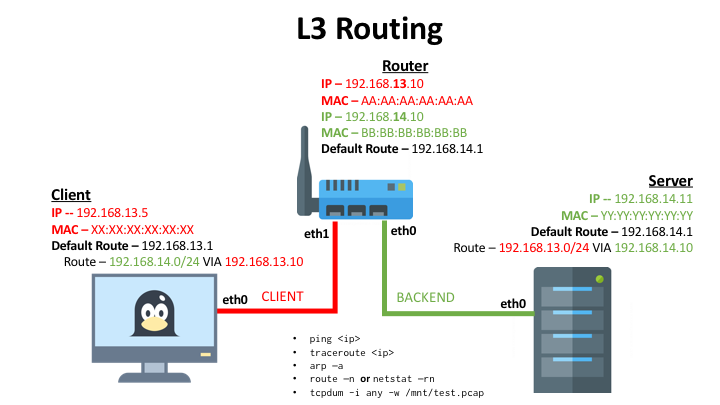

# Intermediate Networking

Here is a breakdown of the various exercises that can be performed with the following provided environment topologies within each subsequent folder's `docker-compose.yaml` file. There are three simple topologies provided where you can investigate network traffic within the docker network. There are two advanced topologies provided as well within the [`Advanced`](./Advanced) directory.

> Pre-requisite for this tutorial is to have [Docker installed](https://docs.docker.com/engine/installation/) on your local machine. 

### [Topology 1](./Switch)


This topology is a simple environment with a **Client** and **Server** are on a single **LAN** network.
  
  * Explore `arp` commands
  * Explore `ping` commands
  * Expolre `tcpdump` commands
  * Explore `curl` commands

>Follow [these instructions](./Switch) to get started.

### [Topology 2](./Router)



This topology is a simple environment with a **Client**, **Server**, and a **Router** across two LAN networks: **CLIENT** and **BACKEND**.
  
  * Explore `arp` commands
  * Explore `ping` commands
  * Expolre `tcpdump` commands
  * Explore `curl` commands
  * Explore `traceroute` commands 
  * Explore [`route`](https://www.cyberciti.biz/faq/linux-route-add/) commands

>Follow [these instructions](./Router) to get started.

### [Topology 3](./Proxy) 


This topology is a simple environment with a **Client**, **Server-a**, **Server-b** and a **Reverse Proxy** across two docker networks: **CLIENT** and **BACKEND**.
  
  * Explore `arp` commands
  * Explore `ping` commands
  * Expolre `tcpdump` commands
  * Explore `curl` commands
  * Explore `traceroute` commands

>Follow [these instructions](./Proxy) to get started.

### Advanced Topologies and Exercises

Read more more [here](./Advnaced)

# General Instructions

## Provisioning Your Environment. 

If you perfer to provision a sandboxed self-contained environment for testing, then proceed to [follow these instructions](./sandbox.md) prior to executing subsequent steps. 

Within each environment's respective directory (`Switch`, `Router`, `Proxy`) enter the following commands to provision your environment for the respective module: 

```
docker-compose up -d
```

This will spin up configured infrastructure components as described above. 

### De-provision your environment

Within the same directory you provisioned the environment, enter the following command: 

```
# Assuming you are in ./NTW-201/Switch or ./NTW-201/Router or ./NTW-201/Proxy directory, enter: 
docker-compose down
```

### Accessing your service's CLI

Once your containers are running and your environment has provisioned successfully, you can execute into the shell of any infrastructure component. See command and descriptions below.

** To view running containers, enter the following. **
```
docker ps -a

>>>

CONTAINER ID        IMAGE                  COMMAND                  CREATED             STATUS              PORTS                      NAMES
319ece0e578f        mayankt/webserver:a    "/bin/sh -c 'nginx'"     19 minutes ago      Up 19 minutes       80/tcp, 443/tcp            router_server_1
c7f5cbca0cdd        mayankt/ubuntu:ntw     "tail -f /dev/null"      19 minutes ago      Up 19 minutes                                  router_client_1
2d461cadd589        chsliu/docker-webmin   "/bin/sh -c '/usr/..."   19 minutes ago      Up 19 minutes       0.0.0.0:10000->10000/tcp   router_router_1
```

**Execute into the shell of a container, enter the following.**
```
docker-compose exec <service-name> bash
```
> Service name can be found in the [docker-compose.yaml](./docker-compose.yaml) file. For example you can enter the following values with respect to your provisioned environment: 
  * client
  * server
  * server-a
  * server-b
  * router
  * cpx
  * edge-router
  * router-2

# Common Linux Networking Commands 

Below are references to common networking commands to configure your client or to inspect network traffic across the various containers. 

1. .**Display Routing Table:** Enter the following to visualize your local host's routing table. 

    ```
    # Display all of your your routes
    route -n
    
    # You can also use the following to show Kernel IP routing table
    netstat -rn
    ```

2. [**Delete a Route**:](https://serverfault.com/questions/181094/how-do-i-delete-a-route-from-linux-routing-table) Enter the following command to remove a route from your host's local routing table.  

    ```  
    # Delete desired route, for example your default gateway
    route del -net 0.0.0.0 gw 192.168.13.1 netmask 0.0.0.0 dev eth0
    ```

3. [**Add a Static Route**](https://www.cyberciti.biz/faq/linux-route-add/)

    ```
    route add -net 192.168.14.0/24 gw 192.168.13.10 dev eth0
    ```

4. **Show Arp Table**: Enter the following command

    ```
    arp -n
    ```

5. [**Collect Network Trace:**](http://packetlife.net/media/library/12/tcpdump.pdf) Enter the following command to collect all TCP packets in the trace across all interfaces and write out to a `test.pcap` file in the `/tmp` directory that you can open in [WireShark](https://www.wireshark.org/).

    ```
    tcpdump -i any -w /mnt/client.pcap
    ```

6. **Trace route:** Enter the following command to see all your hops across the network to your destination ip

    ```
    traceroute 192.168.14.11
    ```


